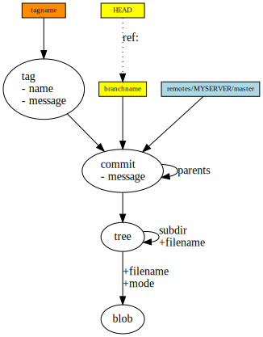

Pumbling é o complemento da "porcelain". Que é um conjunto de
comandos que existem para compor outros comandos.



Criando objeto
--------------

```
echo "test content" | git hash-object -w --stdin

find_date
cat $(run_function object_path d670) | zlib-flate -uncompress


git hash-object -w test.txt
```


Cat-file
--------

### Retornar o tipo

```
git cat-file -t object_id

```

### Retornar o conteúdo

```
git cat-file -p object_id

```

Atualizando o index
-------------------

```
git update-index --add --cacheinfo 100644 objectHash fileName.txt
git write-tree
```

Adicionando árvores aninhadas
-----------------------------

```
git read-tree --prefix=nomeDaPasta d8329fc1cc938780ffdd9f94e0d364e0ea74f579

```

Comitando
---------

```
echo "first commit message" | git commit-tree treeHash

```

### Commit com pai


```
cho "commit second" | git commit-tree 0155eb4229851634a0f03eb265b69f5a2d56f341 -p 035de1de9c497bdcf9bbbdbaab8e5902e3711ce2

```


Criando branch
--------------


```
echo "2016cc9fb2a892886946fe2ab4354ec9d40f181d" > .git/refs/heads/master

```

Criando a HEAD
--------------

```
 echo "ref: refs/heads/master" > .git/HEAD
```

Criando um objeto manualmente
-----------------------------


Visualizar o conteúdo comprimido
--------------------------------

```
cat .git/objects/28/e697e796c79e4c86fcb62e5319a43dfcf1fb83 | zlib-flate -uncompress


```

Tipos de objetos
----------------

- blob
- tree
- commit
- tag

A árvore mais recente
---------------------

```
git cat-file -p master^{tree}

```

Commit iterativo
----------------


```
irb
content = "what is up, doc?"
header = "blob #{content.length}\0"
require "digest/sha1"
store = header + content
sha1 = Digest::SHA1.hexdigest(store)
require 'zlib'
zlib_content = Zlib::Deflate.deflate(store)
path = '.git/objects/' + sha1[0,2] + '/' + sha1[2,38]
require 'fileutils'
FileUtils.mkdir_p(File.dirname(path))
File.open(path, 'w') {|f| f.write zlib_content}
```
